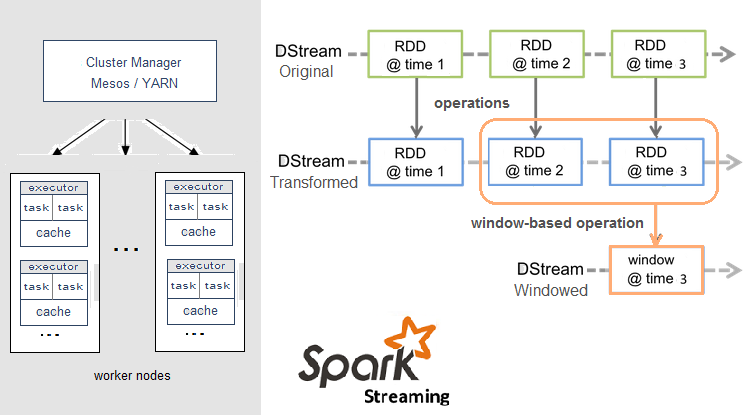
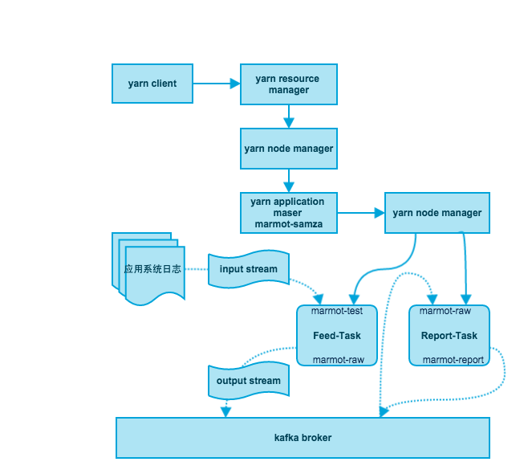

# Hello Samza

### 引入分布式计算
引入分布式计算的目的是解决如下两个问题：

- 实时分析的使能
- 离线分析的提效

实时分析的场景有很多，比如在线用户访问日志的实时统计和分析。相比打点落盘（通常使用被统计应用自身的数据库），再定时统计，分布式计算减少了统计环节并保证了实时性，且对被统计的应用本身没有负担。

离线分析虽然对时间没有严格的要求，但使用串行处理会让使用者很抓狂。一个设计优良的统计分析系统一定要容纳各种格式的输入，这也是UNIX文化之一；如果统计分析的前提是要求原始数据必须行列化，当这个中间过程没有程序化时，人工成本的额外消耗（纵然只是等待）是毫无价值的，而且这里牺牲了对原始数据的保存，潜在丢失信息——在设计行列字段时没有考虑进去的信息。因地制宜地引入分布式计算技术，可以解决这两个问题：兼容输入的格式、减少统计分析总时长，而且会将原始日志和统计分析的全部中间步骤的日志都持久化（为扩展的统计做冗余）。

### 业务场景
这里以用户访问日志作为假想业务需求，考量分布式计算的技术选型。

比如，访问日志的原始数据如下：

```json
{"raw":"豹子头 林冲,1430286079442","id":1,"time":1430286079442}
{"raw":"金枪手 徐宁,1430286089446","id":2,"time":1430286089446}
{"raw":"短命二郎 阮小五,1430286099450","id":3,"time":1430286099450}
……
{"raw":"九纹龙 史进,1430286299499","id":23,"time":1430286299499}
{"raw":"入云龙 公孙胜,1430286309502","id":24,"time":1430286309502}
{"raw":"小旋风 柴进,1430286319507","id":25,"time":1430286319507}
……
```

访问计数的统计结果如下：

```json
{
  "没羽箭 张清": 2,
  "美髯公 朱仝": 1,
  "九纹龙 史进": 1,
……
  "病关索 杨雄": 1,
  "智多星 吴用": 2,
  "活阎罗 阮小七": 1,
  "[minimum]花和尚 鲁智深": 10004
}
```

### 大数据·流处理框架对比
在分析了当下的分布式计算框架后，我选择了samza：

- samza默认使用kafka存储数据，考虑存储原始数据，kafka是理想的选择。
- 不严格地说，storm适合实时计算、spark适合批量计算，而samza居中。
- 资源管理和调度系统是可替换的，默认使用yarn，可以使用mesos替换（当然spark也是可以的）。

这里给出Apache的三大主要流处理框架的主要属性对比，详见下表。

||Storm|Spark|Samza|
|:--|:--|:--|:--|
|Archtecture||||
|Stream Source|Spouts|Receivers|Consumers|
|Stream Primitive|Tuple|DStream|Message|
|Stream Computation|Bolts|Transformations<BR>Window operations|Tasks|
|Delivery Semantics|At Least Once<BR>Trident:Exactly-Once|Exactly Once|At Least Once|
|State Management|Stateless|Stateful|Stateful|
|Latency|Sub-Second|Seconds|Sub-Second|
|Source code Language|Clojure|Scala|Scala|
|Language Support|Any|Scala,Java,Python|Scala,Java|
|Companies|Twitter, Yahoo!, Spotify, The Weather Channel...|Amazon, Yahoo!, NASA JPL, eBay Inc., Baidu…|LinkedIn, Intuit, Metamarkets, Quantiply, Fortscale…|

### Samza的背景知识「来自官网」
#### 什么是消息

消息系统是一种实现近实时异步计算的流行方案。消息产生时可以：

- 被放入一个消息队列（ActiveMQ，RabbitMQ）
- 发布-订阅系统（Kestrel，Kafka）
- 日志聚合系统（Flume、Scribe）。

下游消费者从上述系统读取消息并且处理它们或者基于消息的内容产生进一步的动作。 假设你有一个网站，并且每次有人要加载一个页面，你发送一个“用户看了页面”的事件给一个消息系统。你可能会有一些做下面事情的消费者：

- 为了未来做数据分析，存储消息到Hadoop；
- 对页面访问量进行计数并且更新到Dashboard
- 如果页面访问失败触发一个报警；
- 发送一封邮件通知另一个用户；
- 带着这个用户的相关信息加入页面展示事件，并且返回信息给消息系统；

总结一下，很显然，一个消息系统能解耦所有这些来自实际网页服务的工作。

#### 什么是流处理
大家知道消息系统是一个相当低层次的基础设施——它存储消息等待消费者消费他们。当你开始写产生或者消费消息的代码时，你很快会发现在处理层会有很多恶心的问题需要你亲自处理。而Samza的目标就是帮助我们干掉这些恶心的家伙！

咱们那上面提到的（计算PV并更新到Dashboard）例子来说吧，当你的正在跑的消费者机器突然挂掉了，并且你当前的计算的数值丢失了会发生什么？怎么恢复？当机器服务被重启时处理该从哪里开始？如果底层的消息系统重复发送了一条信息或者丢失了一条消息怎么办？或者你想根据url来分组统计PV？又或者一台机器处理的负载太大，你想分流到多台机器上进行统计在聚合？

流式计算为上述问题提供了一个很好的解决方案，它是基于消息系统更高层次的抽象。

#### Samza
Samza是一个流式计算框架，它有以下特性：

- 简单的API：和绝大多数低层次消息系统API不同，相比MapReduce，Samza提供了一个非常简单的“基于回调（callback-based）”的消息处理API
- 管理状态：Samza管理快照和流处理器的状态恢复。当处理器重启，Samza恢复其状态一致的快照。Samza的建立是为了处理大量的状态
- 容错性：当集群中有一台机器宕机了，基于Yarn管理的Samza会立即将你的任务导向另一台机器；
- 持久性：Samza通过Kafka保证消息按顺序写入对应分区，并且不会丢失消息；
- 扩展性：Samza在每一层都做了分区和分布。Kafka提供了顺序的、分区、可复制的、容错的流。YARN则为Samza的运行提供了一个分布式环境
- 可插拔：虽然Samza在Kafka和YARN的外部工作，但是Samza提供了可以让你在其它消息系统和执行环境里运行的可插拔的API
- 处理器隔离：运行在YARN上的Samza同样支持Hadoop安全模型以及通过linux CGroups进行资源隔离

Samza区别于其他框架的几个方面：

- Samza支持局部状态的容错。状态自己作为一个流被构造。如果因为机器宕机本地状态丢失，那么状态流会回放重新存储它
- 流是有序、分区的、可回放的并且是容错的
- YARN用来处理隔离、安全和容错
- 任务之间是解耦的：如果有一个任务慢了并且造成了消息的积压，系统其它部分不会受到影响；

### Samza的基本概念「来自官网」
#### Streams
Samza是处理流的。流则是由一系列不可变的一种相似类型的消息组成。举个例子，一个流可能是在一个网站上的所有点击，或者更新到一个特定数据库表的更新操作，或者是被一个服务或者事件数据生成所有日志信息。消息能够被加到另一个流之后或者从一个流中读取。一个流能有多个消费者，并且从一个流中读取不会删除消息（使得消息能够被广播给所有消费者）。另外消息可以有一个关联的key用来做分区，这个将在后面说明。

Samza支持实现流抽取的可插拔系统：在kafka里，流是一个topic（话题），在数据库里我们可以通过消费从一个表里更新操作读取一个流；而在hadoop里我们可能跟踪在HDFS上的一个目录下的文件。


#### Jobs
Samza的jobs 是对一组输入流设置附加值转化成输出流的程序（见下图）。为了扩展流处理器的吞吐量，我们将任务拆分更小的并行单元：分区Partitions和任务Tasks

#### Partitions
每个流都被分割成一个或多个分区，并且在流里的每一个分区都总是一个有序的消息序列。每个消息在这个序列里有一个被叫做offset（中文称它为偏移量），它在每一个分区里都是唯一的。这个偏移量可以是一个连续的整数、字节偏移量或者字符串，这取决于底层的系统实现了。

当有一个消息加入到流中，它只会追加到流的分区中的一个。这个消息通过写入者带着一个被选择的key分配到它对应的分区中。举个例子，如果用户id被用作key，那么所有和用户id相关的消息都应该追加到这个分区中。


#### Tasks
一个Job通过把他分割成多个任务Task进行扩展。任务Task作为Job的并行单元，就好比上述提到的流中的分区。每个任务Task为每个Job输入流消费来自一个分区的数据。

按照消息的偏移，一个任务按序处理来自它的输入分区的消息。分区之间没有定义顺序，这就允许每一个任务独立执行。YARN调度器负责分发任务给一台机器，所以作为一个整体的工作Job可以分配到多个机器并行执行。

在一个Job中任务Task的数量是由输入分区决定的（也就是说任务数目不能超过分区数目，否则就会存在没有输入的任务）。可是，你能改变分配给Job的计算资源（比如内存、cpu核数等）去满足job的需要，可以参考下面关于container的介绍。

另外一个值得注意的是分配给task的分区的任务绝不会改变：如果有一个任务在一台失效的机器上，这个task会被在其它地方重启，仍然会消费同一个流的分区。


#### Dataflow Graphs
我们能组合多个Jobs去创建一个数据流图（DAG 有向无环图），其中**节点**表示包含数据的流，而**边**则是进行数据传输。这个组合纯粹是通过Jobs作为输入和输出的流来完成。这些Jobs也是解耦的：他们不需要基于相同的代码库，并且添加、删除或者重启一个下游任务不会影响上游的任务。


#### Containers
分区Partitions和任务Tasks都是并行的*逻辑*单元——他们不会与特定的计算资源（CPU、内存、硬盘等）的分配相符合。Containers则是*物理的*并行单元，并且一个容器本质上是一个Unix进程（或者Linux cgroup）。每个容器跑着一个或多个Tasks。Tasks的数量是从输入的分区数自动确定和固定下来的，但是容器的数量（CPU、内存资源）是在运行时用户设定的并且能在任何时刻改变。

### Samza的架构「来自官网」
Samza是由以下三层构成：

- 数据流层（A streaming layer）
- 执行层（An execution layer）
- 处理层（A progressing layer）

相应地，Samza提供开箱即用的支持：

数据流（Streaming）：分布式消息中间件Kafka
执行（Execution）：Hadoop资源调度管理系统YARN
处理（Processing）： Samza API


类比Hadoop架构模式（存储由HDFS负责，执行层由YARN负责，而处理层则由MapReduce负责）：


在你进一步了解这三层的每一部分前，应该要注意到对于Samza的支持并不局限于使用Kafka和YARN，具体需要根据你的业务场景来确定使用什么技术框架、工具作支持。特别是Samza的执行层和数据流层都是可插拔的，并且允许开发者自己去实现更好的替代品。

#### [Kafka](http://kafka.apache.org/documentation.html)

Kafka是一个分布式发布/订阅消息队列系统，它支持至少一次通信保障（即系统保证没有信息丢失，但是在某些故障情况下，消费者可能收到超过一条同样的信息）和高度可用的分区特性（即使一台机器宕机了，分区依然是可用的）。

对于Kafka来讲，每一条数据流被称为一个topic。每一个话题都在多台被称作broker的机器上进行分区和复制。当一个生产者发送一条消息给一个话题，它会提供一个key，这个key被用来决定这条消息应该被发送到哪一个分区。生产者发送信息而Kafka的broker则接收和存储它们。Kafka的消费者能通过在一个话题的所有分区上订阅消息来读取消息。

值得补充的是，Kafka有一些有趣的特点：

- 带着同一个key的所有消息都被划分到同一个分区，这就意味着如果你想要读到一个特定用户的所有消息，你只要从包含这个用户id的分区读取即可，而不是整个topic（假设把用户id用作key）
- 一个topic的分区是按顺序到达的一序列消息，所以你可以通过单调递增偏移量offset来引用任何消息（就好比放一个索引到一个数组里）；这也意味着broker不需要跟踪被一个特定的消费者读取的消息，为什么呢？因为消费者保存了消息的偏移量offset能够跟踪到它。然后我们知道的是带着一个比当前偏移量小的消息是已经被处理过的，而每一个带着更大偏移量的消息还没有被处理过。

#### YARN

[YARN](http://hadoop.apache.org/docs/current/hadoop-yarn/hadoop-yarn-site/YARN.html)（Yet Another Resource Negotiator）是新一代Hadoop集群调度器。它可以让你在一个集群中配置一个容器，并且执行任意命令。一个应用和YARN交互：

- Application：hi YARN Boy！我想用512MB内存在两台机器上跑命令X；
- YARN：Cool， 你的代码在哪里？
- Application：代码在这里呢。
- YARN：我在网格node1和node2上执行你的Job啦。

Samza使用YARN去管理部署、容错、日志、资源隔离、安全以及本地化。简述如下，详见[这里](http://hortonworks.com/blog/apache-hadoop-yarn-background-and-an-overview/)。

##### YARN的架构
YARN有三个组成部分：资源管理器（ResourceManager）、节点管理器（NodeManager）和应用管理器（ApplicationMaster）。

在一个YARN网格里，每一台机器上都跑着NodeManager，它负责在所在的机器上启动进程。ResourceManager与所有的NodeMananger交互告诉它们跑什么应用，反过来NodeManager也会告诉ResourceManager它们希望什么时间在集群里跑这些东东。ApplicationMaster让特定应用的代码跑在YARN集群上，它负责管理应用的负载、容器（通常是UNIX进程），并且当其中一个容器失败时发出通知。

##### Samza和YARN

Samza提供了一个YARN ApplicationMaster和一个开箱即用的YARN Job运行器。如图所示（不同的颜色表示不同的机器）：


Samza的客户端告诉YARN的RM（ResourceManager，以下简称RM）运行一个新的Job，RM会告诉YARN的一个NodeManager（简称NM）为Samza的ApplicationMaster（AM）在集群里分配空间。一旦NM分配了空间，就会启动这个Samza的AM。AM开始后，它会向RM请求运行[SamzaContainers](http://samza.apache.org/learn/documentation/0.9/container/samza-container.html)所需的YARN containers。RM和NMs一起为containers分配空间。一旦空间被分配，NMs就会开启Samza containers。

### marmot-samza

samza的文档和示例都真心不给力，我以[hello-samza](https://github.com/apache/samza-hello-samza)为基础，摸索实现了上述需求，示例项目代号marmot-samza。
marmot-samza减少了hello-samza中与流程没有必然关系的环节，突显主线流程。欢迎获取[示例代码](https://github.com/feuyeux/hello-samza)并交流。

#### 依赖版本信息
marmot-samza已经将hello-samza项目主要软件的版本升级到最新，详见下表。

|Software|Version|
|:--|:--|
|Samza|0.9|
|Hadoop|2.7.0|
|Kafka|kafka_2.10-0.8.2.1|
|Zookeeper|3.4.6|
|Java|1.8|

#### 架构和流程


- Feed-Task接收应用日志的实时输出，将其存入kafka。
- Report-Task定时获取原始数据，并做聚合计算，将结果存入kafka。

### 下一步

示例为了展示samza的工作流程，提供的是单机环境，而且配置都是默认的，因此没有考虑可用性和性能。
在实际的项目中，需要分布式部署。为了避免每个项目都要从头搭建一套分布式计算的环境，下一步应考虑使用Docker镜像来实现。

### 参考
- https://github.com/apache/samza-hello-samza
- http://samza.apache.org/learn/documentation/0.9
- http://www.javacodegeeks.com/2015/02/streaming-big-data-storm-spark-samza.html
- http://wyyhzc.gitbooks.io/hadoop2x/content/bei_jing.html
