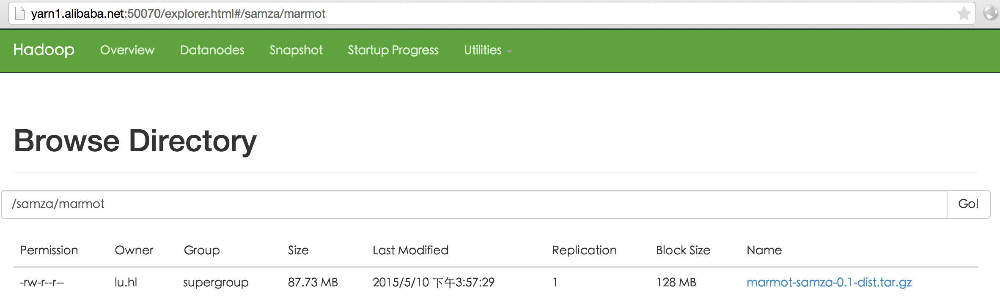

## On Han-Yosemite.local

### Scheduler

nano cp.sche.sh && chmod +x cp.sche.sh

```shell
cd /Users/erichan/sourcecode/feuyeux/hello-samza/doc/
for n in yarn1 yarn2 yarn3; do
  scp capacity-scheduler.xml lu.hl@$n.alibaba.net:/opt/hadoop-2.7.0/etc/hadoop;
done
```

### Samza Job
/Users/erichan/sourcecode/feuyeux/hello-samza/src/main/config/marmot-report.properties
/Users/erichan/sourcecode/feuyeux/hello-samza/src/main/config/marmot-feed.properties

```
yarn.package.path=hdfs://100.69.198.109:8020/samza/marmot/marmot-samza-0.1-dist.tar.gz
```

### Copy to yarn server
```
cd /Users/erichan/sourcecode/feuyeux/hello-samza
mvn clean package
scp target/marmot-samza-0.1-dist.tar.gz lu.hl@yarn1.alibaba.net:/home/lu.hl
```

## On yarn1.alibaba.net

### Upload to hdfs
#### first time
```
cd
hadoop fs -mkdir -p /samza/marmot
hadoop fs -put marmot-samza-0.1-dist.tar.gz /samza/marmot
```
#### after first time
```
cd
hadoop fs -put -f marmot-samza-0.1-dist.tar.gz /samza/marmot
```

[/samza/marmot](http://yarn1.alibaba.net:50070/explorer.html#/samza/marmot)



### Run feed
```
cd
rm -rf marmot
mkdir marmot
tar -xvf marmot-samza-0.1-dist.tar.gz -C marmot
/home/lu.hl/marmot/bin/run-job.sh  \
--config-factory=org.apache.samza.config.factories.PropertiesConfigFactory \
--config-path=/home/lu.hl/marmot/config/marmot-feed.properties
```

## On ka1.alibaba.net
### Check feed
```
/opt/kafka_2.11-0.8.2.1/bin/kafka-console-consumer.sh --zookeeper zk1.alibaba.net:2181,zk2.alibaba.net:2181,zk3.alibaba.net:2181 --topic marmot-raw
```
## On yarn1.alibaba.net
### Run report

```
/home/lu.hl/marmot/bin/run-job.sh \
--config-factory=org.apache.samza.config.factories.PropertiesConfigFactory \
--config-path=/home/lu.hl/marmot/config/marmot-report.properties
```

## On ka2.alibaba.net
### Check report
```
/opt/kafka_2.11-0.8.2.1/bin/kafka-console-consumer.sh --zookeeper zk1.alibaba.net:2181,zk2.alibaba.net:2181,zk3.alibaba.net:2181 --topic marmot-report
```

## Extension
#### call flow
```
/home/lu.hl/marmot/bin/run-job.sh  --config-factory=org.apache.samza.config.factories.PropertiesConfigFactory --config-path=/home/lu.hl/marmot/config/marmot-feed.properties
==>
run-class.sh 
classname org.apache.samza.job.JobRunner
--config-factory=org.apache.samza.config.factories.PropertiesConfigFactory
--config-path=file://$PWD/deploy/samza/config/marmot-feed.properties
==>
/opt/jdk1.8.0_45//bin/java 
-Dlog4j.configuration=file:/home/lu.hl/marmot/bin/log4j-console.xml 
-Dsamza.log.dir=/home/lu.hl/marmot 
-Djava.io.tmpdir=/home/lu.hl/marmot/tmp 
-Xmx768M 
-XX:+PrintGCDateStamps 
-Xloggc:/home/lu.hl/marmot/gc.log 
-XX:+UseGCLogFileRotation 
-XX:NumberOfGCLogFiles=10 
-XX:GCLogFileSize=10241024 
-d64 
-cp …… 
org.apache.samza.job.JobRunner 
--config-factory=org.apache.samza.config.factories.PropertiesConfigFactory 
--config-path=/home/lu.hl/marmot/config/marmot-feed.properties
```

DONE